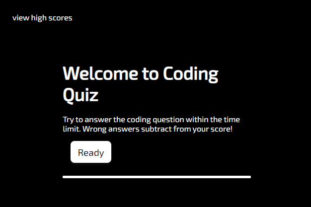

# code-quiz

Javascript coding quiz.
Repo is [here](https://github.com/japankid-code/code-quiz).
Outstanding issues [here](https://github.com/japankid-code/code-quiz/issues).
Site is deployed [here](https://japankid-code.github.io/code-quiz/).

## outline

clicking the start button starts the timer and presents a question.
answering the question correctly leads to another question.
wrong answers subtract from the time remaining.
if all questions are answered or timer reaches 0: quiz is finished.
prompt to enter in initials and save score in a list.
user scores are stored in local storage for the high score list.

### mockup

below gif outlines intended functionality:

### preview

preview of site here:

